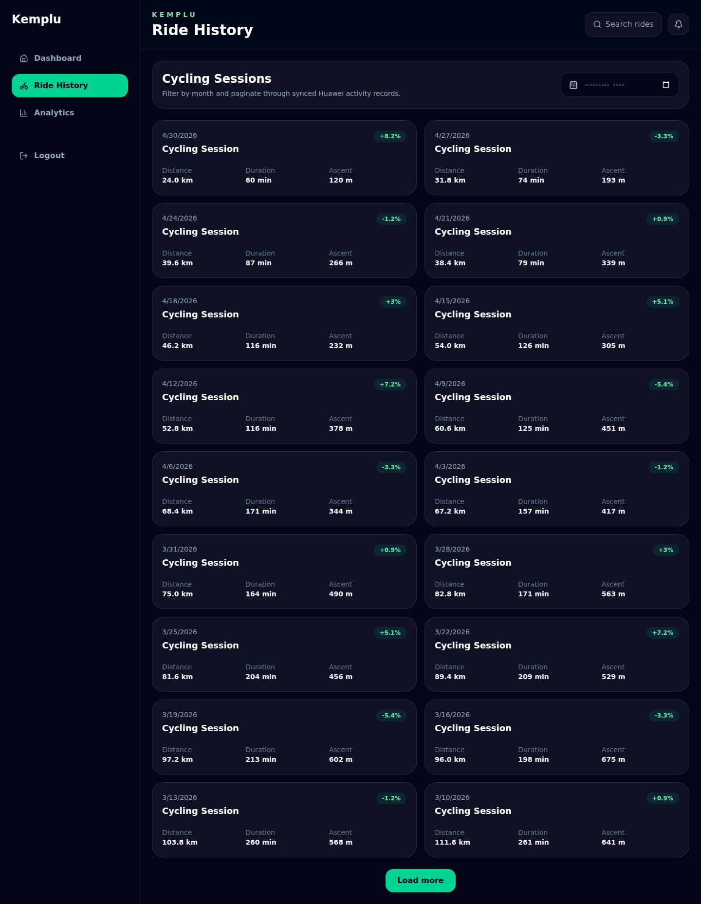
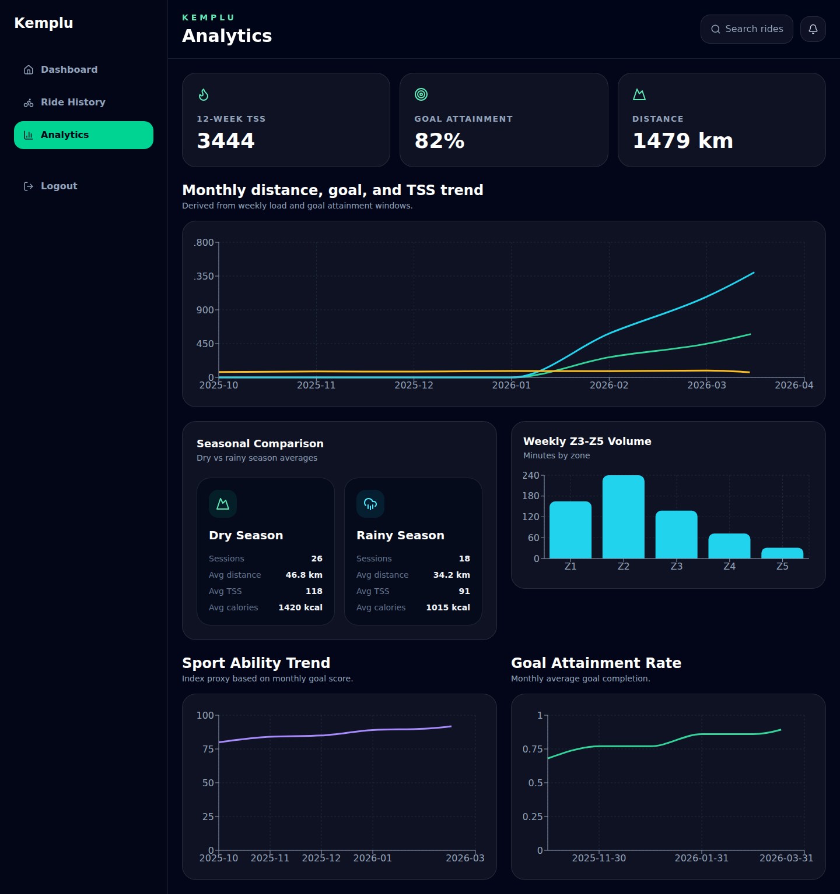
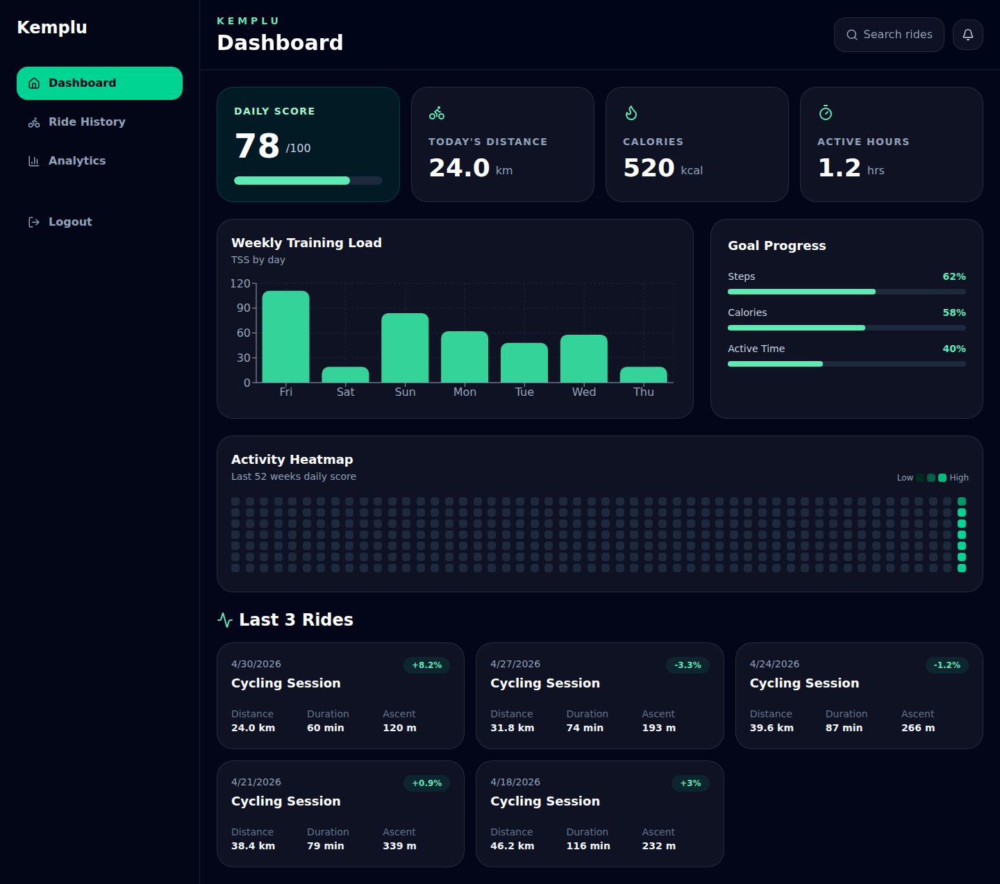

# Kemplu

Kemplu is a cycling performance dashboard for riders who use HUAWEI Health. It turns synced activity data into a focused view of ride history, training load, seasonal trends, goal progress, and readiness signals so cyclists can understand how their recent work is shaping their fitness.

The app is designed to be useful before a full production integration is available: real HUAWEI Health OAuth is supported by the backend, and a built-in demo mode lets anyone explore the product with realistic sample cycling data.

## Product Overview

Kemplu connects to HUAWEI Health, imports cycling sessions and daily activity summaries, then presents them in a dashboard built around repeatable training decisions. Instead of only listing workouts, it highlights the metrics riders tend to check before planning the next ride: distance, elevation, calories, training stress, intensity distribution, goal completion, recent load, and readiness.

The current product experience includes:

- A home dashboard with daily score, today distance, calories, active hours, weekly load, goal progress, and recent rides.
- Ride history with cycling-focused filters and detailed ride pages.
- Training load analytics across weekly distance and TSS trends.
- Seasonal comparison for dry-season and rainy-season riding patterns.
- Intensity distribution and goal-attainment analytics.
- Readiness scoring based on recent load balance, freshness, consistency, and daily activity.
- Secure HUAWEI OAuth login and token-backed API sessions.
- Demo mode for exploring the interface without connecting a HUAWEI account.

## Screenshots

The repository includes product screenshots in `frontend/screenshots`.









## Key Experiences

### Performance Dashboard

The dashboard summarizes the rider's latest activity into clear, scannable cards and charts. It combines daily activity signals with recent rides so users can see whether they are building consistency, recovering, or pushing load.

### Ride History and Details

Kemplu stores cycling sessions with distance, duration, ascent, calories, average speed, training stress score, performance delta, season tag, and the raw HUAWEI payload. Ride detail views can also surface elevation and intensity-zone data when available.

### Training Analytics

Analytics endpoints and screens focus on weekly load, seasonal averages, intensity distribution, goal attainment, and readiness. These views are intended to answer practical training questions: how much work has accumulated, how hard recent riding has been, and whether the rider is ready for more intensity.

### Sync Automation

After a new HUAWEI login, Kemplu triggers an initial 365-day sync. A scheduler then refreshes all users every 6 hours with the latest 7 days of data. Manual sync is also exposed through the API.

## HUAWEI Health Connection and Demo Mode

Kemplu supports HUAWEI Health through OAuth:

1. The frontend asks the backend for a HUAWEI authorization URL.
2. The backend stores and validates OAuth state in Redis.
3. HUAWEI redirects back to the backend callback URL.
4. The backend exchanges the authorization code, stores tokens in Redis, creates or finds the Kemplu user, and redirects back to the frontend with a session token.

For local evaluation, demo mode is enabled by `VITE_ENABLE_DEMO_MODE=true`. Demo mode stores a mock session token in the browser and uses sample cycling data from the frontend, so the dashboard can be explored without HUAWEI credentials or a completed Health Kit setup.

Set `VITE_USE_MOCKS=true` when you want the frontend to always use mock API data during development.

## Tech Stack

- Frontend: React, TypeScript, Vite, React Router, Recharts, Tailwind CSS, lucide-react.
- Backend: FastAPI, Python 3.12, SQLAlchemy asyncio, Pydantic Settings, APScheduler, python-jose, httpx.
- Data stores: PostgreSQL 16 and Redis 7.
- Runtime: Docker Compose for local multi-service development.

## Getting Started with Docker

### Prerequisites

- Docker and Docker Compose.
- HUAWEI Health Kit credentials for real account connection, or demo mode for local exploration.

### Start the App

From the repository root:

```bash
cp .env.example .env
docker compose up --build
```

The Compose file starts four services:

- `backend`: FastAPI app running on port `8000` inside the Docker network.
- `frontend`: Vite dev server running on port `5173` inside the Docker network.
- `postgres`: PostgreSQL database.
- `redis`: Redis token, OAuth state, and cache store.

Backend secrets are interpolated from `.env` into the backend service only. The frontend service receives only `VITE_*` variables, which are intended to be browser-facing configuration. Avoid sharing `docker compose config` output publicly because it expands environment variables and can print secret values.

The current `docker-compose.yml` uses `expose` rather than host `ports`, so the frontend and backend are available to other containers on the `kemplu_net` network. If you want to open the app directly from the host browser, publish ports locally, for example:

```yaml
frontend:
  ports:
    - "5173:5173"

backend:
  ports:
    - "8000:8000"
```

Then visit `http://localhost:5173`.

## Local Development

You can also run the frontend and backend directly on your machine while keeping PostgreSQL and Redis in Docker.

### Backend

```bash
cd backend
python -m venv .venv
source .venv/bin/activate
pip install -r requirements.txt
uvicorn app.main:app --host 0.0.0.0 --port 8000 --reload
```

The backend exposes a health check at `GET /health` and interactive FastAPI documentation at `http://localhost:8000/docs`.

### Frontend

```bash
cd frontend
npm install
npm run dev -- --host 0.0.0.0
```

For production-style frontend validation:

```bash
cd frontend
npm run build
npm run preview -- --host 0.0.0.0
```

## Configuration

Copy `.env.example` to `.env` and fill in values for your environment.

| Variable | Purpose |
| --- | --- |
| `HUAWEI_CLIENT_ID` | HUAWEI OAuth client ID. |
| `HUAWEI_CLIENT_SECRET` | HUAWEI OAuth client secret. |
| `HUAWEI_REDIRECT_URI` | Backend callback URL registered with HUAWEI. Defaults should point to `/api/auth/huawei/callback`. |
| `HUAWEI_AUTH_URL` | HUAWEI OAuth authorization endpoint. |
| `HUAWEI_TOKEN_URL` | HUAWEI OAuth token endpoint. |
| `HUAWEI_HEALTH_BASE_URL` | HUAWEI Health Kit API base URL. |
| `POSTGRES_USER` | PostgreSQL user used by the Compose database service. |
| `POSTGRES_PASSWORD` | PostgreSQL password used by the Compose database service. Set this in `.env`; do not commit real credentials. |
| `POSTGRES_DB` | PostgreSQL database name used by the Compose database service. |
| `DATABASE_URL` | Async SQLAlchemy PostgreSQL URL used by the backend outside Compose. In Compose, this is assembled from the PostgreSQL variables above. |
| `REDIS_URL` | Redis URL. Compose default is `redis://redis:6379/0`. |
| `SECRET_KEY` | Secret used for API session token signing. Set a strong value outside local demos. |
| `APP_VERSION` | Application version metadata. |
| `FRONTEND_URL` | URL the backend redirects to after successful OAuth. |
| `TIMEZONE` | Application timezone, defaulting to `Asia/Jakarta`. |
| `ACCESS_TOKEN_EXPIRE_MINUTES` | API session token lifetime. |
| `VITE_API_BASE_URL` | Browser-facing backend base URL used by the React app. |
| `VITE_USE_MOCKS` | Forces all frontend API calls to use mock data when `true`. |
| `VITE_ENABLE_DEMO_MODE` | Shows the demo-mode path on the login page when `true`. |

For local host-based development, these values are typically useful:

```env
FRONTEND_URL=http://localhost:5173
VITE_API_BASE_URL=http://localhost:8000
HUAWEI_REDIRECT_URI=http://localhost:8000/api/auth/huawei/callback
VITE_ENABLE_DEMO_MODE=true
```

## API Overview

All product APIs are served by the FastAPI backend.

| Method | Path | Description |
| --- | --- | --- |
| `GET` | `/health` | Service health check. |
| `GET` | `/api/auth/huawei/login` | Creates OAuth state and returns a HUAWEI authorization URL. |
| `GET` | `/api/auth/huawei/callback` | Handles HUAWEI OAuth callback, token exchange, user creation, and frontend redirect. |
| `POST` | `/api/auth/logout` | Revokes the stored token for the current session. |
| `GET` | `/api/dashboard/summary` | Returns daily score, goals, heatmap, weekly load, and recent rides. Supports `days=7`, `30`, or `365`. |
| `GET` | `/api/rides` | Lists user rides with pagination and optional sport/date filtering. |
| `GET` | `/api/rides/{activity_id}` | Returns ride detail, elevation, and intensity-zone data when available. |
| `GET` | `/api/analytics/readiness` | Returns readiness score, recommendation, component scores, and load metrics. |
| `GET` | `/api/analytics/weekly-load` | Returns weekly TSS and distance totals. |
| `GET` | `/api/analytics/seasonal` | Returns dry-season and rainy-season activity averages. |
| `GET` | `/api/analytics/intensity-distribution` | Returns recent time distribution across intensity zones. |
| `GET` | `/api/analytics/goal-attainment` | Returns monthly goal completion and daily-score trends. |
| `POST` | `/api/sync/trigger` | Queues and runs a manual 7-day sync for the current user. |

Authenticated endpoints expect an `Authorization: Bearer <session-token>` header.

## Project Structure

```text
kemplu/
├── backend/
│   ├── app/
│   │   ├── routers/       # FastAPI route modules
│   │   ├── services/      # HUAWEI, sync, readiness, and data processing services
│   │   ├── models/        # SQLAlchemy models
│   │   └── schemas/       # Pydantic response models
│   ├── Dockerfile
│   └── requirements.txt
├── frontend/
│   ├── src/
│   │   ├── api/           # API client and mock data
│   │   ├── components/    # Cards, charts, and layout components
│   │   ├── hooks/         # Auth and dashboard hooks
│   │   ├── pages/         # Dashboard, analytics, ride, auth, and policy pages
│   │   └── types/         # Shared frontend types
│   ├── screenshots/       # Product screenshots used in this README
│   ├── Dockerfile
│   └── package.json
├── .env.example
└── docker-compose.yml
```

## Status and Roadmap

Kemplu is in an early product-development stage. The core dashboard, demo experience, OAuth flow, sync service, analytics routes, and Docker-based local environment are present. Likely next steps include:

- Publishing host ports or adding a production reverse-proxy profile.
- Hardening HUAWEI Health Kit scope handling and production OAuth settings.
- Adding database migrations and operational runbooks.
- Expanding automated tests around sync normalization, readiness scoring, and API contracts.
- Refining deployment configuration for staging and production environments.
